

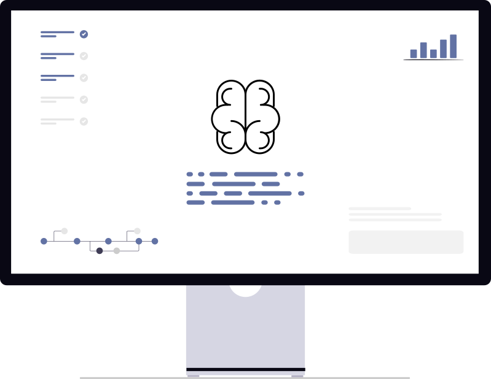

# AI Developer Day

---

# AI Developer Day
  

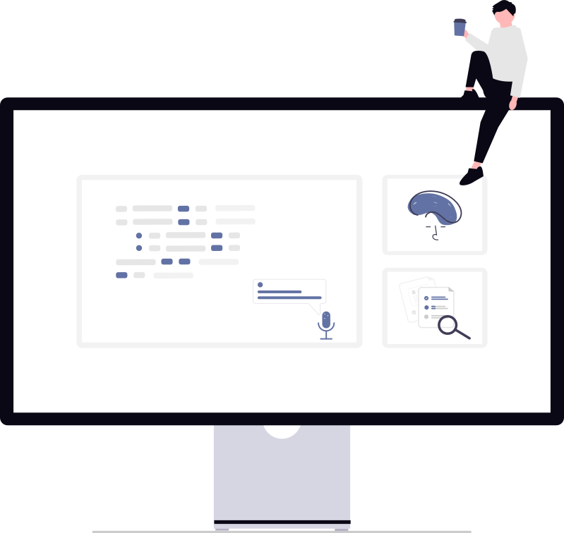

**Instructors:**
Patrick O'Connor
Garrett Smith

---

# Reminder

Today's class is intended for developers. We'll provide support along the way, but expect all attendees to be able to:
* **Run commands in terminal/command line** - Navigate directories, execute scripts, and use basic shell commands
* **Write and understand code** - Comfortable with at least one programming language (Python or TypeScript/JavaScript)
* **Use Git/GitLab/GitHub** - Clone repositories, create branches, and make commits  

---

## Today's Agenda

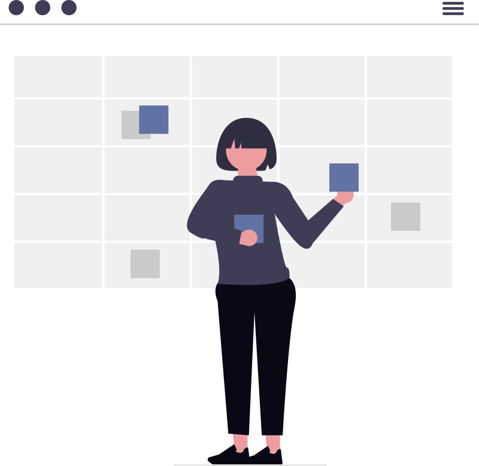

* **Session 1:** Setup & Environment
* **Session 2:** Vibe Coding Fundamentals
* **Session 3:** Advanced Techniques
* **Session 4:** MCP Ecosystem

---

# Survey

Scan the QR code or visit:

[https://forms.office.com/r/iX1MDRW50E](https://forms.office.com/r/iX1MDRW50E)

---

# Session 1: Setup & Environment

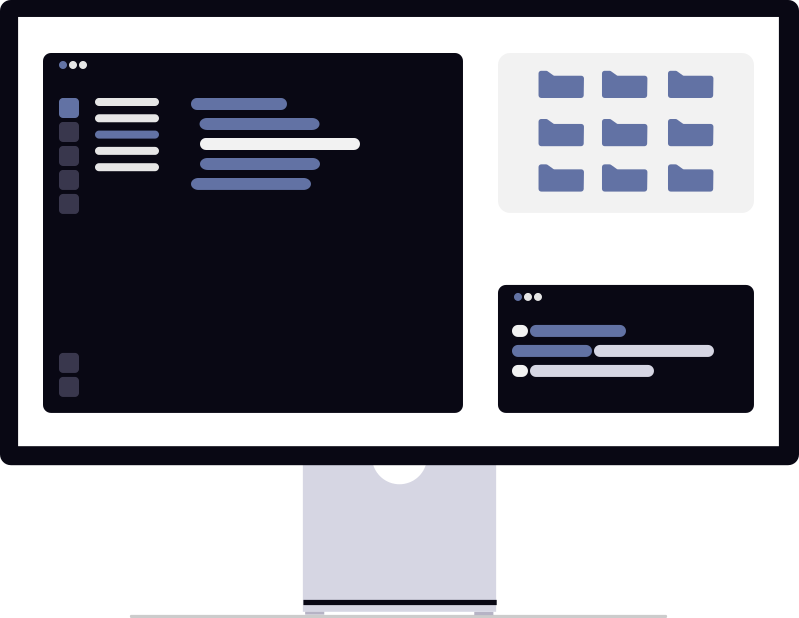

- Environment setup & validation
- AI development assistants comparison
- Getting started with Cursor 2.0

---

## Getting Started

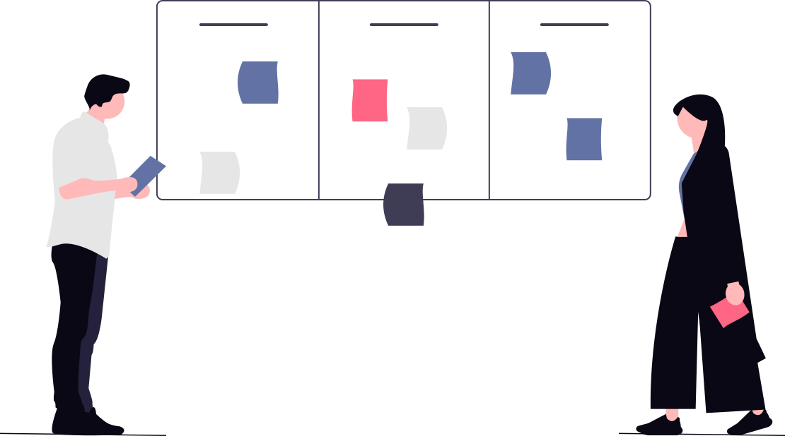

Welcome to Cursor!
Your account has been provisioned!

Follow the Cursor setup in the email labeled `Action Required`

---

## Lab Resources
We've compiled slides, documentation, and code for labs into a workshop repository.

Please choose either Gitlab or Github:
- [github.disney.com/ai-workshops/ai-developer-day](https://github.disney.com/ai-workshops/ai-developer-day)
- [gitlab.disney.com/ai-workshops/ai-developer-day](https://gitlab.disney.com/ai-workshops/ai-developer-day)
---

## Environment Validation

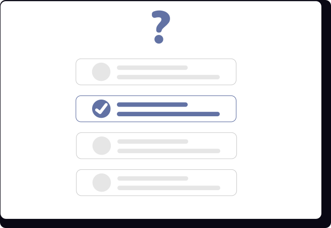

**Test your setup via Cursor:**

- Ask Cursor to help you create a simple script (e.g. fizzbuzz in bash or powershell)
- Test basic file operations (read, write, edit)
- Verify Cursor can execute bash commands

---

## AI Development Tools Comparison

- **Cursor 2.0** vs **Claude** vs  **Q-Developer** vs **GitHub Copilot**
- Same models, different developer experience
- Understanding strengths of each tool

---

# Session 2: Vibe Coding Fundamentals

Master the art of collaborating effectively with AI development tools

---

## Context in AI Development

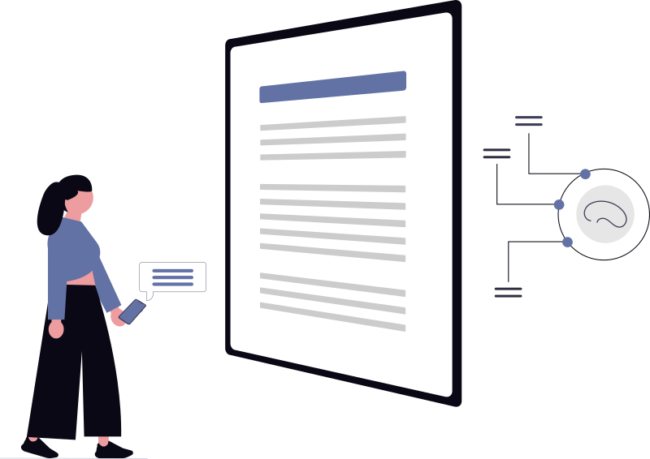

Providing the right context:
- **Errors** and stack traces
- **Browser interactions**
- **Images** and screenshots
- **Data** and schemas
- **Documentation** and standards
---

## Exercise

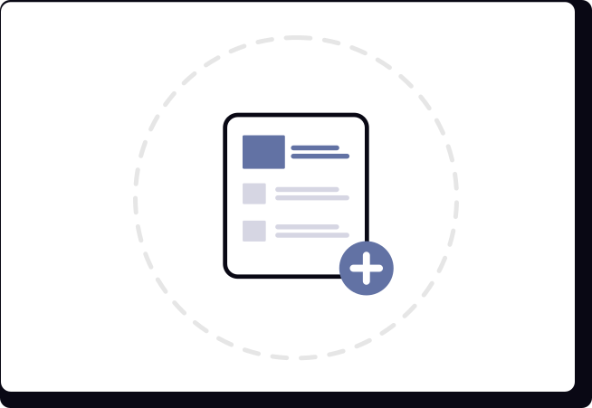

Providing the right context:

- **Docs** - [Wiz AI secure rules](https://github.com/wiz-sec-public/secure-rules-files)

- **Images** - drag and drop to chat

---

## Context Management

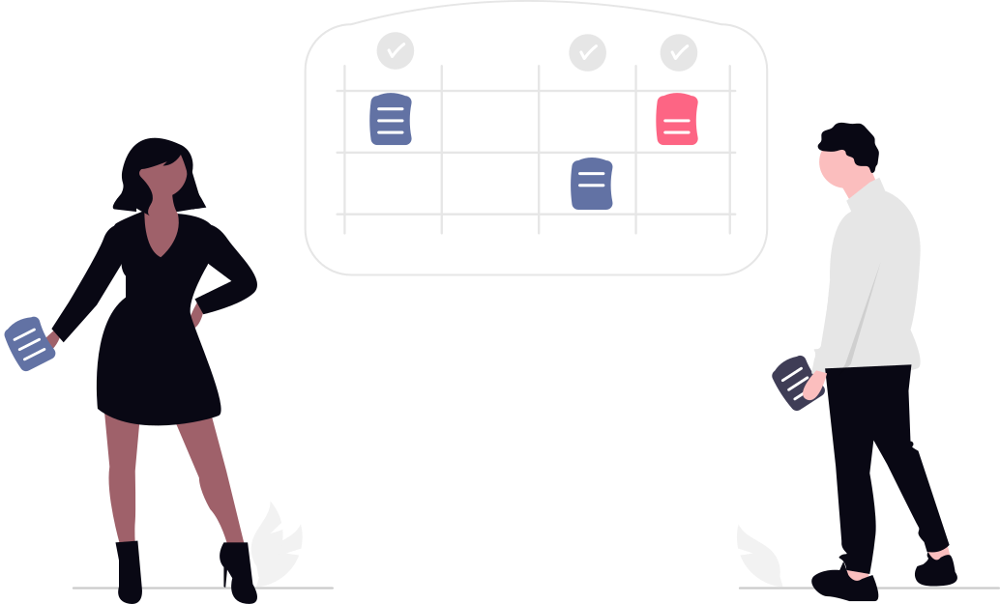

- Context approaches evolve (large conversation vs targeted)
- Cursor 2.0 maintains context within chat sessions
- Context tied to conversations
- Chat history automatically preserved

---

## Exercise: Context Exploration

- Close and reopen Cursor 2.0
- Access previous chat conversations from history
- Explore chat panel management (sidebar navigation)

💭 Question: When does Cursor's context gets truncated/summarized?

---

## Composer: Cursor's Proprietary Model

- **Composer** - Agentic coding model (4x faster, tasks in <30s)
- **200,000 token context** (~15,000 lines of code)
- Trained on real-world software engineering challenges
- Optimized for interactive development workflows

---

## Model Selection Options

- **Auto** - Cursor selects optimal premium model automatically
- **Frontier models** - GPT-5, Claude
- **Max Mode** - Extended context window (slower, higher cost)
- Balance speed, intelligence, and cost per use case

---

## Handling Inconsistency

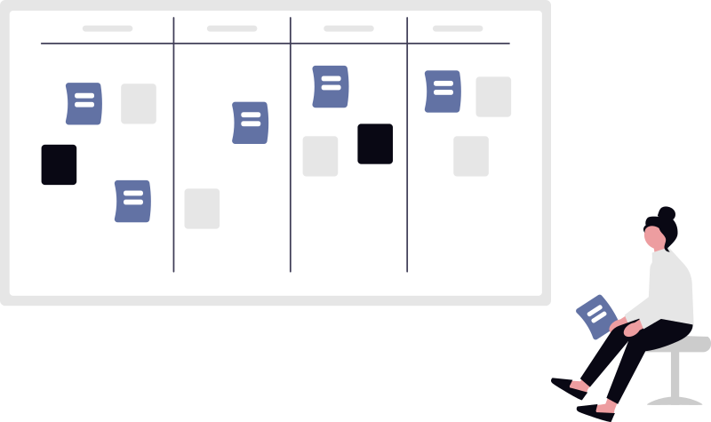

**Interactive Exercise in Composer Mode (`Cmd+I` / `Ctrl+I`):**

*"How would you build a simple script that finds all available pets in the swagger petstore api, and how would you test it works?"*

---

## Rules and Project Guidelines

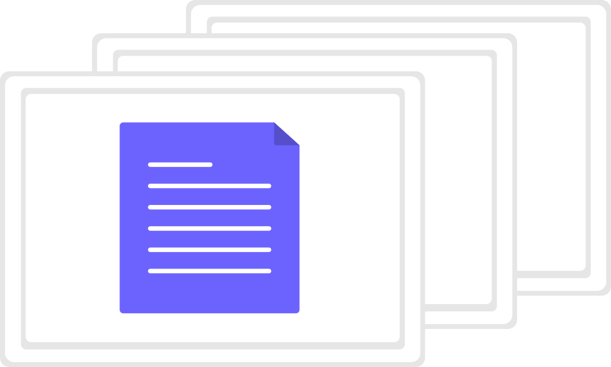

**Rules provide consistency:**
- *"Our APIs are built with language X, framework Y, using testing approach Z"*
- Configured via `.cursor/rules/` directory with `.mdc` files
- Project-specific rules with multiple files for organization

---

## Exercise: Creating Rules

- Navigate to **Cursor Settings > Rules**
- Creates `.mdc` files in `.cursor/rules/` directory
- Add project rules and guidelines
- Rerun previous development plan with rules
- Compare results with and without constraints

---

## Memory Management

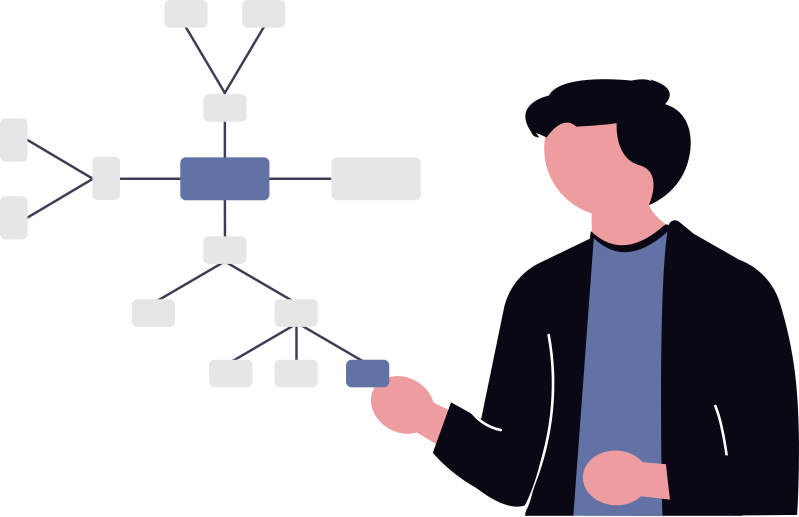

**Cursor 2.0 Memories**
- **Auto-saved memories** - Cursor learns from your corrections and preferences
- **Manual memories** - Add explicit facts, constraints, or context
- **Smart context attachment** - Memories automatically included when relevant

---

## Exercise: Adding Memory

Add tribal knowledge via Cursor Rules

**Configuration options:**
- Creates `.mdc` files in `.cursor/rules/` directory
- Include project-specific guidelines and patterns
- Rule types: Always, Auto Attached, Agent Requested, Manual

---

## Core Tools Overview

- **Read and write files** in your codebase
- **Search through code** to find relevant functions or patterns
- **Run shell commands** to test code or install packages
- **Access documentation** or **search the web** for current information
- Check for errors by **running linters or tests**

---

### Hands-on Lab: First Vibe Coding

**Getting Started:**
- Create new repository/folder (e.g.,`ai-day-lab`)
- Open Cursor in that folder
- Open Composer mode in Cursor (`Cmd+I` / `Ctrl+I`)
- Ready to vibe!

---

## Lab Prompt

**Your Mission:** Create a simple website to demonstrate the API at:
https://github.com/cheatsnake/emojihub

---

## Lab: Development Phase

- Plan out the work
- Use Chat mode for iterative development (`Cmd+L` / `Ctrl+L`)
- Build with Cursor's guidance
- Watch the magic happen!

Your Mission: Create a simple website to demonstrate the API at:
https://github.com/cheatsnake/emojihub

---

## Lab: Finishing Strong

- Test thoroughly
- Run and see your creation
- Celebrate success!
- Incorporate into SDLC (commits, issues, MR/PR)

---

# Break

---

# Session 3: Advanced Techniques

Level up your AI development skills

---

## Token Usage Monitoring

- **Usage dashboard** → Monitor token usage (Settings)
- **Optimization Strategies** → Rules, Project Requirements, Documentation

---

## Optimizing Token Usage

- **Limit data/queries** → Reduce costs
- **Scoped Development** → Stay focused
- **Local DB caching** → Speed + savings
- **ASCII mockup planning** → Cost effective and quick

---

## Exercise: UI Refactoring

- Return to your lab repo project
- Propose UI refactor in Browser Tab Mode
- Provide feedback before Cursor builds

---

## Advanced Lab Setup

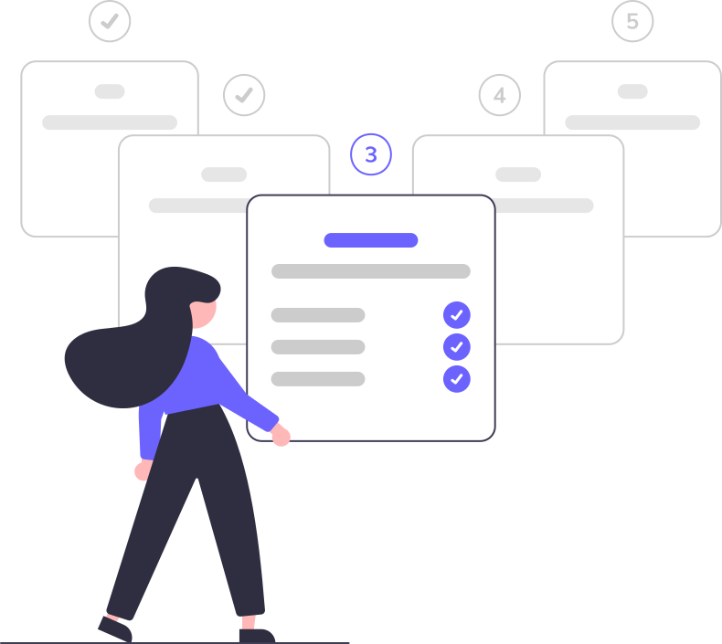

- **Lab Setup** → [Lab Setup Docs](./instructions/lab-repos-setup.md)
- **Docker Desktop** → [Docker Setup Docs](./instructions/docker-setup.md)

---

## Planning Strategies

- **Plan Mode** → Think before coding (multi-file edits)
- **Chat Mode** → Iterative development and Q&A
- **Spec Files** → Clear requirements
- Break work into manageable pieces

---

## Exercise: Project Documentation

Create markdown documents for a project pivot:

- Product Requirements Document
- Epic Spec
- Feature breakdown
- Story format

---

## Multi-Agent Systems Introduction

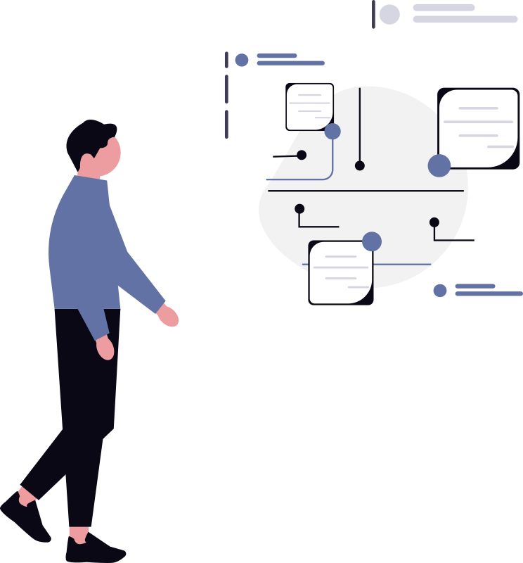

- Multiple AI agents with specialized roles
- Like a dev team: frontend, backend, QA, DevOps
- Specialized agents focus on their strengths
- Workspace setup

---

## Multi-Agent Use Cases

- **Code review workflows**: Writer + reviewer agents
- **Complex systems**: UI + API + database agents
- **Testing scenarios**: Generation + execution + analysis
- **Documentation**: Code + docs + review agents

---

## Agent Coordination Strategies

#### Coordination Patterns

- **Sequential**: Agent A → Agent B → Agent C
- **Parallel**: Multiple agents simultaneously
- **Hierarchical**: Supervisor managing workers

---

## Benefits & Considerations

**Benefits:**

- Specialization and focused expertise
- Parallel Development

**Considerations:**

- Coordination complexity
- Communication overhead

---

## Multi - Agent Labs

Apply multi-agent concepts to enhance your project:

- Agent creation and coordination
- Planning phase with multiple perspectives
- Development
- QA Testing

---

## Lab: Agent Setup

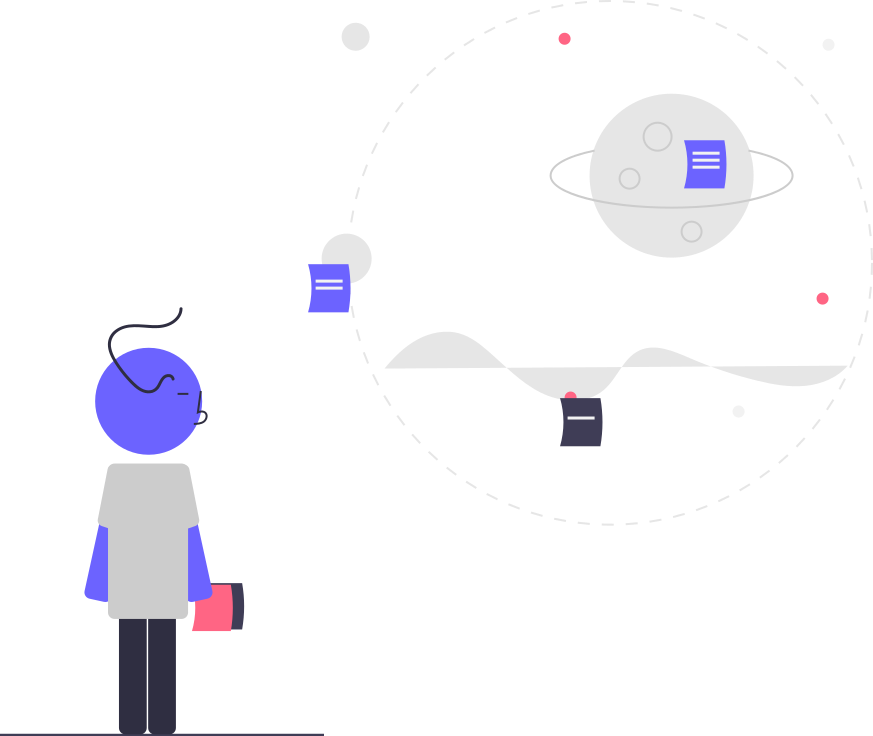

Ask agent to create an AGENTS.md file for the following agent personas:

- Planning Agent: writes clear product requirements for each agent.
- Developer Agent: writes code based on product requirements.
- QA Agent: Writes tests and verifies functionality of code based on product requirements.

---

## Lab: Put The Agents to Work

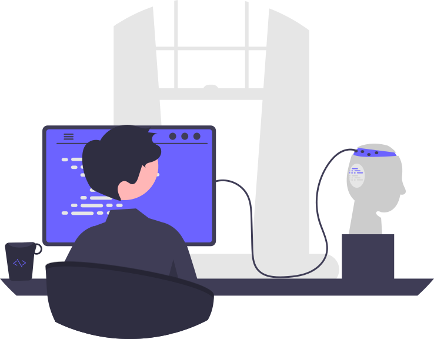

Enhancement Request: 

**Implement a "list all movies" endpoint with filters for each field and fuzzy search capabilities.**

---
# Break

__MCP labs will require `node` specifically `npx`. We will show this, but if you want to do this yourself, use the break to get setup (optional)__

---

# Session 4: MCP Ecosystem

Explore the Model Context Protocol

---

## What is Model Context Protocol?

**MCP** is an open protocol connecting AI applications to data sources and systems

**Learn more:** [modelcontextprotocol.io](https://modelcontextprotocol.io)

---

## How MCP Works

- **Client** → AI application (Cursor, Claude, VS Code, etc.)
- **Server** → Data source or tool integration
- **Protocol** → Standard communication layer

**Result:** AI gets live access to your tools and data

---

## Why MCP?

**The Problem:**
- AI models have static, outdated data

**The Solution:**
- Live connections to your tools and data

---

## MCP Ecosystem

- **9** Official SDKs
- **1000+** Available Servers
- **70+** Compatible Clients

---

## MCP Use Cases

- **Development** → Code repos, databases, APIs
- **Productivity** → Calendar, email, tasks
- **Analysis** → Real-time metrics, logs, monitoring
- **Creative** → Design tools, asset libraries, CMS

---

## Off-the-Shelf MCP Servers

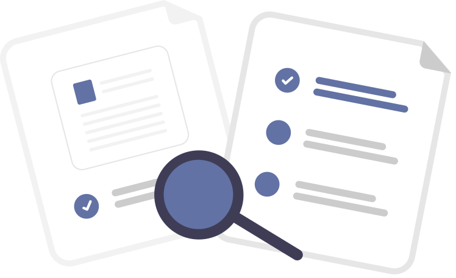

**Playwright** - Browser automation
**Context7** - Up-to-date software documentation

---

## MCP Protocols

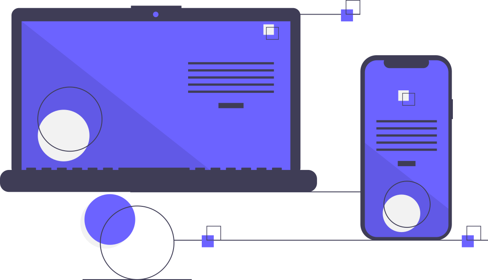

**Three transport protocols:**
- **STDIO** - Standard input/output (local)
- **HTTP** - RESTful communication (remote)
- **SSE** - Server-sent events (streaming)

---

## Why MCP vs CLI/REST?

**Advantages:**
- Standardized protocol for AI tools
- Built-in schema validation
- Better context management
- Native AI tool integration

---

## Building Custom MCP Servers

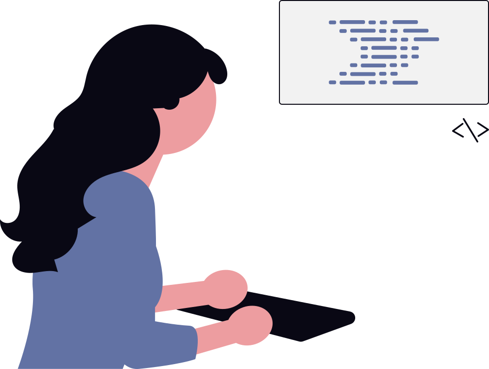

**Create servers that expose:**
- **Tools** - Functions AI can call
- **Resources** - Data AI can access
- **Prompts** - Reusable prompt templates

---

## MCP Building Tools

**MCP Inspector**
- Local testing and debugging
- Interactive tool testing
- Schema validation

[github.com/modelcontextprotocol/inspector](https://github.com/modelcontextprotocol/inspector)

---

## Hands-on Lab: Build Your MCP Server

**What We'll Build:**
- Custom MCP server with multiple tools
- Local testing with MCP Inspector
- Cursor 2.0 integration
- Choose Python or TypeScript

**Time:** ~45 minutes

---

## Lab Exercise Structure

1. **Setup** (5 min) - Environment and dependencies
2. **Basic Server** (15 min) - On Movie API Repo
3. **Add Tools** (20 min) - Add Movie MCP
4. **Test** (10 min) - MCP Inspector testing
5. **Integrate** (10 min) - Add to Cursor 2.0

---

## Group Discussion and Q&A

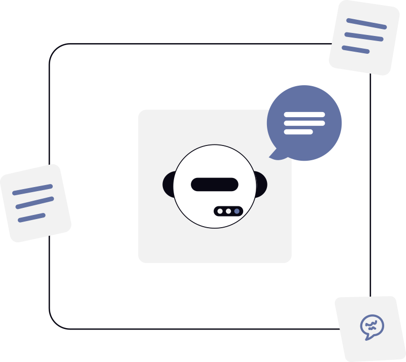

- Share experiences
- Address challenges
- Best practices discussion

---

## Thank You

**Next Steps:**

- Apply learned concepts
- Experiment with different approaches
- Build custom MCP servers
- Share knowledge with your teams

---

## Resources

- **Cursor 2.0 Docs**: [docs.cursor.com](https://docs.cursor.com)
- **MCP Protocol**: [modelcontextprotocol.io](https://modelcontextprotocol.io)
- **Workshop Repo**: Internal GitLab/GitHub
- **Setup Guide**: [MCP-Setup.md](./MCP-Setup.md)
